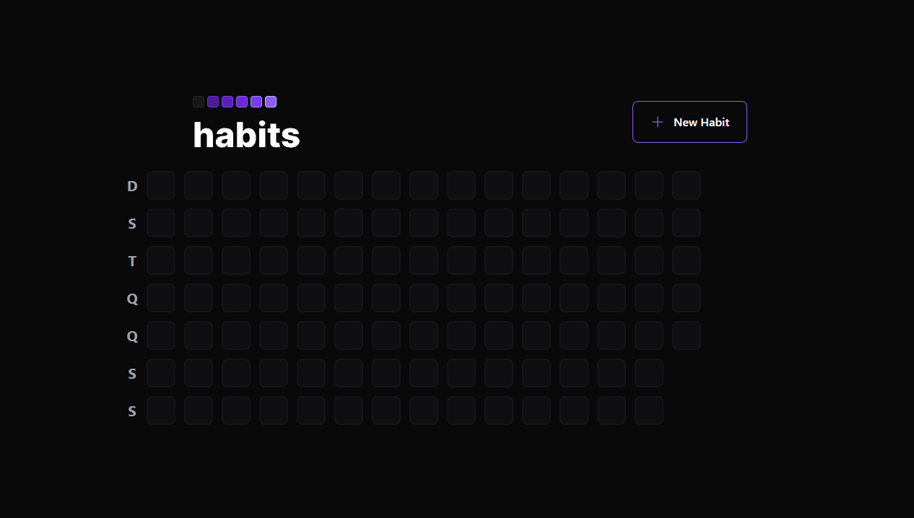
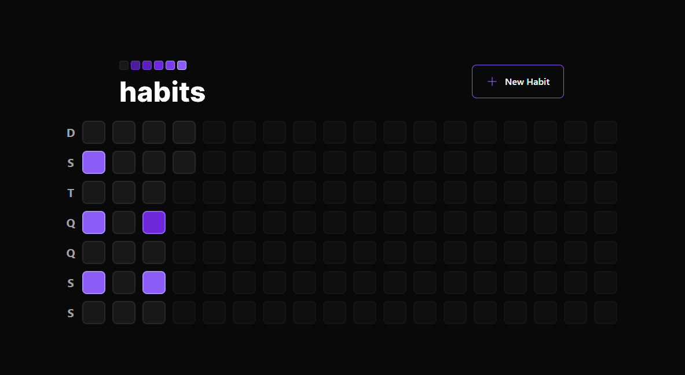

#  🚀 Habit Tracker

> In this project, you can control your habits by doing a daily checkout, you can add new habits, and you have a progress lookup similar to GitHub activities, depending on the amount of habits for that determinate day, and the amount you complete, the color of the bracket will be in some color.

O projeto ainda está em desenvolvimento e as próximas atualizações serão voltadas nas seguintes tarefas:

- [ ] Implementar a possibilidade de login e autenticação de usuarios
- [ ] Possibilitar a exclusão de determinado habito via o App.

## Project Layout 🟪

#### Initial Screen

#### Functional Layout

#### Register New Habit
